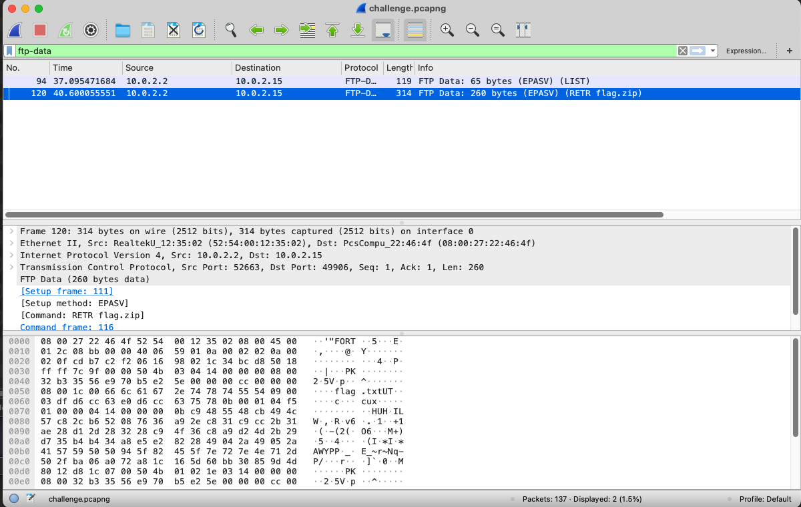
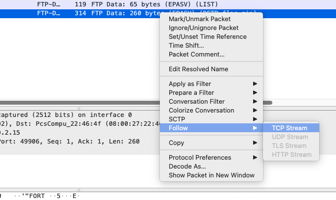
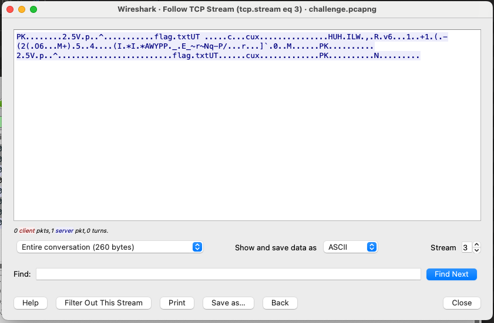

# PCAP

Use Wireshark to find and extract the secret file from a network capture!

# Setup

Upload `challenge.pcapng` somewhere, and provide a link to it in CTFd.

# Solution

Part 1 Flag `SC4{is-this-my-pass}`

Part 2 Flag: `SC4{pl4int3xt-pr0toc0lz-ftw-1990}`

## Part 1 Steps

1. Follow TCP Stream on the first packet, i.e. filter by `tcp.stream eq 0`

2. Flag will be visible in plaintext. Alternatively, you can just `strings` and `grep` for the flag.

## Part 2 Steps

1. Filter by `ftp-data` protocol (FTP creates a new TCP connection when transferring files)

2. Right click, then Follow TCP Stream

3. A new window will open. This has the magic number PK, indicating that it is a zip.

4. There is an option to save. Set _Show and save data as [...]_ to _Raw_. Then, save this TCP stream as a zip. 

5. This zip file can simply be unzipped. The flag is in `flag.txt`

Are you wondering "What's the deal with all the junk in `flag.txt`?" If I just had the flag in the `txt` file, there would be nothing to compress. If there's no compression, then it becomes trivial to complete Part 2, since the flag will appear as plaintext in the TCP dump. You could then solve the challenge by doing `strings challenge.pcapng | grep SC4`. I added the junk to give the compression algorithm some material to work with when it does its compression magic, which makes the `strings` solution impossible.

